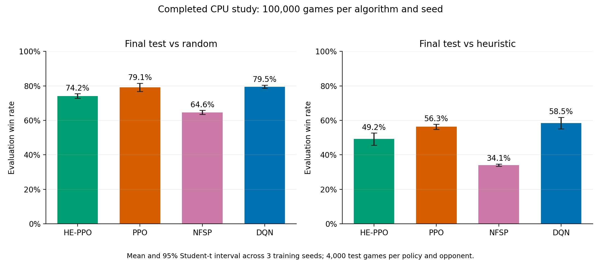
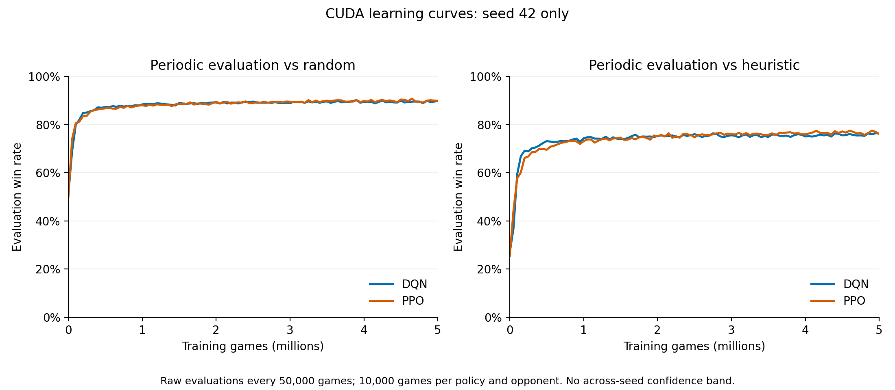
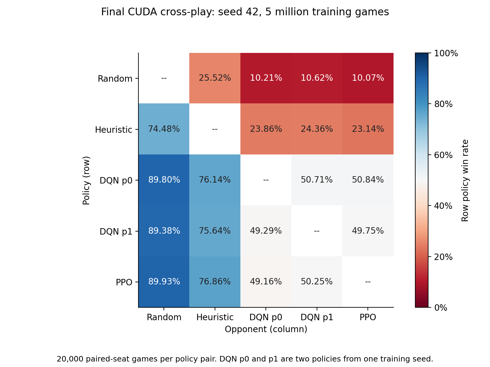
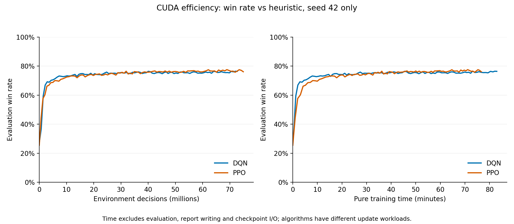
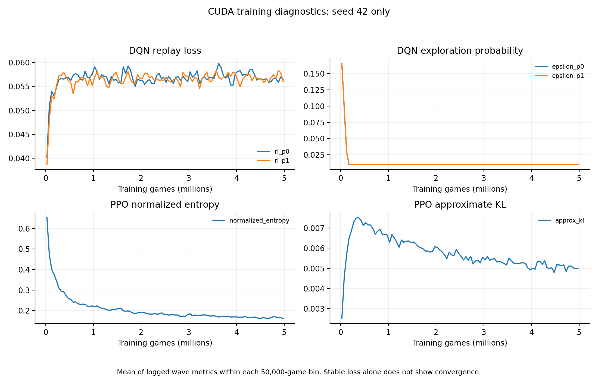

# SchnapsenGameAI: A Study of Self-Play Learning

## Abstract

This project studies reinforcement learning in Schnapsen, a two-player card game with hidden information. We compare Double DQN, PPO, high-entropy PPO (HE-PPO), and Neural Fictitious Self-Play (NFSP). A completed CPU experiment uses three training seeds and 100,000 games per algorithm and seed. DQN and PPO give the strongest results in this experiment. A longer CUDA experiment has completed 5 million games for DQN and PPO with seed 42. Their final win rates against the heuristic opponent are **75.86% and 76.92%**. Their direct comparison is close to 50%. The learning curves show smaller gains near the end, but the available results do not establish convergence or an overall best algorithm.

## 1. Research questions

We ask three questions:

1. Which method performs better against fixed opponents and against the other learned policies?
2. How does performance change with training games, environment decisions, and training time?
3. Does the final part of training provide enough evidence to stop increasing the budget?

A high win rate against a fixed opponent is useful evidence of performance. It does not measure exploitability or prove that a policy is a Nash equilibrium.

## 2. Method

### Game, observations, and models

The project uses a Rust game engine and PyTorch learning code. The neural networks receive 465 features from the player's available information. They do not receive the opponent's hidden hand or the hidden deck order in the first phase. The representation includes a short history of five records, so it is not a complete memory of the game. A legal-action mask filters 28 action indices. See the [feature analysis](docs/FEATURES.md).

All methods use hidden layers of 256, 128, and 64 units. DQN uses two player policies with Double Q-learning and replay memory. PPO uses a shared actor and value network. HE-PPO adjusts its entropy coefficient toward a target normalized entropy of 0.8. NFSP combines a best-response learner with a supervised average policy. These are implementations of existing methods; this report does not claim a new learning algorithm. The original methods are described in the [Double DQN paper](https://arxiv.org/abs/1509.06461), [PPO paper](https://arxiv.org/abs/1707.06347), and [NFSP paper](https://arxiv.org/abs/1603.01121).

The main settings in the long CUDA experiment are:

| Setting | DQN | PPO |
|---|---|---|
| Learning rate | 0.0003 | 0.0003, fixed |
| Discount factor | 1.0 | 1.0 |
| Parallel environments | 256 | 256 |
| Batch size | 256 replay samples | 512 samples per minibatch |
| Exploration | Epsilon 0.20 to 0.01 over 1 million decisions per player | Entropy coefficient 0.01 |
| Other settings | Replay capacity 100,000 per player; target update every 1,000 RL updates | GAE 0.95; clipping 0.20; up to 4 epochs; target KL 0.02 |

The run uses [recommended DQN settings](configs/recommended_dqn.json) and [recommended PPO settings](configs/recommended_ppo.json), with the command-line device set to CUDA. The templates contain `device: cpu`; the command overrides this value. The saved seed-42 policy configurations also record `cuda`. The recorded environment uses Windows, Python 3.13.5, and PyTorch 2.9.1+cu128. These settings are the tested choices for this project, not proven global optima.

### Evaluation protocol

The random opponent samples legal moves. The heuristic opponent uses fixed rules. Each evaluation uses paired decks and swaps player seats. PPO and NFSP sample their evaluation actions; DQN uses greedy actions. DQN and NFSP results average their two player policies within each training seed. Two policies from one run are not two independent training seeds.

Periodic evaluation uses a fixed evaluation seed. Final tests use a separate seed, and cross-play uses another separate seed. Reported final scores come from the last fixed-budget checkpoint, not the checkpoint with the highest observed validation score.

| Protocol | Completed CPU study | Longer CUDA study |
|---|---:|---:|
| Algorithms | HE-PPO, PPO, NFSP, DQN | DQN, PPO |
| Planned training seeds | 42, 43, 44 | 42, 43, 44, 45, 46 |
| Games per algorithm and seed | 100,000 | 5,000,000 |
| Evaluation interval | 5,000 training games | 50,000 training games |
| Games per evaluation, policy, and opponent | 2,000 | 10,000 |
| Games per final test or cross-play pair | 4,000 | 20,000 |
| Completed full runs | 12 of 12 | 2 of 10 |
| Device | CPU | CUDA |

A training game is one complete game. In this report, an **evaluation round** is the block between two evaluation checkpoints. It is different from a PPO optimization epoch. Thus, 5 million games correspond to 100 evaluation rounds in the CUDA study.

For the CPU study, the error bars are 95% Student-t intervals across three training seeds. They describe uncertainty in the mean across training runs. For the CUDA study, only one seed has completed both algorithms, so we do not show across-seed confidence intervals. Many test games cannot replace independent training seeds.

## 3. Results

### 3.1 Completed comparison at 100,000 games



*Figure 1. Independent final tests after 100,000 training games per algorithm and seed. Error bars use three training seeds. Each policy plays 4,000 test games against each opponent.*

| Algorithm | Win rate vs random, mean [95% CI] | Win rate vs heuristic, mean [95% CI] |
|---|---:|---:|
| HE-PPO | 74.16% [72.85, 75.47] | 49.18% [45.66, 52.69] |
| PPO | 79.15% [76.73, 81.57] | 56.30% [54.81, 57.79] |
| NFSP | 64.65% [63.47, 65.83] | 34.10% [33.44, 34.76] |
| DQN | 79.54% [78.61, 80.47] | 58.47% [55.14, 61.80] |

DQN has the highest mean against both fixed opponents. However, its direct win rate against PPO is 51.89%, with a seed-level 95% interval of [49.62%, 54.16%]. This experiment does not provide a clear DQN-versus-PPO winner.

HE-PPO performs worse than standard PPO under this budget and these settings. Keeping high action entropy may slow the development of a strong policy, but this experiment does not isolate the cause. NFSP's average policy is weaker at this budget. This result does not show that NFSP is generally unsuitable for Schnapsen; it may need different settings or more training. The recorded plateau diagnostic is not satisfied for any algorithm in this short study.

### 3.2 Progress of the longer CUDA experiment

| Algorithm and seed | Recorded training games | Last evaluated checkpoint | Status |
|---|---:|---:|---|
| DQN, 42 | 5,000,000 | 5,000,000 | Final test and cross-play available |
| PPO, 42 | 5,000,000 | 5,000,000 | Final test and cross-play available |
| DQN, 43 | 262,800 | 250,000 | Partial training record |
| Other planned runs | No training records in this snapshot | — | No results available |

The log contains 10,262,800 training games, about 20.53% of the planned 50 million games. The following long-run comparisons use **seed 42 only**. The incomplete seed 43 is excluded from the final comparison.



*Figure 2. Raw periodic evaluations for seed 42. Each point uses 10,000 games per policy and opponent. The lines are not smoothed. These validation scores are separate from the final test scores below.*

| Training games | DQN vs heuristic | PPO vs heuristic |
|---|---:|---:|
| 100,000 | 59.34% | 57.66% |
| 500,000 | 73.16% | 69.59% |
| 1,000,000 | 74.32% | 73.17% |
| 2,000,000 | 75.28% | 75.12% |
| 3,000,000 | 75.59% | 76.12% |
| 4,000,000 | 75.12% | 75.97% |
| 5,000,000 | 76.36% | 76.08% |

Both methods improve strongly in the early part of training. Later gains are smaller and the scores fluctuate. DQN learns faster in the first 500,000 games on this seed, while PPO reaches a similar level with more training. The curves do not increase at every checkpoint.

### 3.3 Independent final tests and direct play

| Algorithm, seed 42 | Final win rate vs random | Final win rate vs heuristic | Mean game-point difference vs heuristic |
|---|---:|---:|---:|
| DQN | 89.21% | 75.86% | +0.7008 |
| PPO | 89.78% | 76.92% | +0.7374 |

PPO leads DQN by 1.06 percentage points against the heuristic in this final test. Both also have a positive game-point difference, so their advantage is visible in a second outcome measure. This is still one training seed. The difference does not establish which method is better across repeated training runs.



*Figure 3. Row policy win rate against the column opponent, using 20,000 games per policy pair. Reverse cells are complements of the same match result. Diagonal cells are not evaluated. These matches use a different seed from the final baseline tests.*

DQN's two player policies win 50.84% and 49.75% against PPO. Their mean is **50.30%**, which is close to an even match. The first policy's deck-pair bootstrap interval is [50.29%, 51.40%]; the second is [49.21%, 50.30%]. These intervals concern evaluation decks for fixed policies. They do not measure variation across training seeds. Together, these results do not support a broad claim that PPO or DQN is the stronger algorithm.

### 3.4 Training cost and learning behaviour



*Figure 4. Seed-42 performance against the heuristic by environment decisions and pure training time. Time excludes evaluation, report writing, and checkpoint I/O; it is not total elapsed experiment time.*

| Algorithm, seed 42 | Training games | Environment decisions | Pure training time |
|---|---:|---:|---:|
| DQN | 5,000,000 | 72,744,095 | 82.94 minutes |
| PPO | 5,000,000 | 74,936,146 | 76.64 minutes |

PPO finishes the same game budget in about 7.6% less pure training time in these runs. It also makes more environment decisions. Equal game counts do not imply equal decision counts or equal optimizer work. The CPU and CUDA experiments have different budgets and seed coverage, so their results cannot be used to estimate a controlled GPU speedup.



*Figure 5. Mean logged wave metrics within 50,000-game bins, for seed 42. These diagnostics are averaged for readability; the evaluation curves in Figures 2 and 4 use raw checkpoints.*

DQN's exploration probability reaches its lower bound of 0.01 well before the final checkpoint. PPO's normalized entropy falls as the policy becomes more selective. Loss, entropy, and KL help describe training, but none of them alone proves that the playing policy has converged. DQN's zero evaluation entropy comes from greedy action selection and should not be interpreted as zero training exploration.

## 4. Discussion and training budget

The main conclusion is that DQN and PPO are the strongest methods among the tested short-run settings. Both achieve much better fixed-opponent performance after the longer run. However, the short and long studies also differ in device, seed coverage, and evaluation size. The learning curves within the CUDA run provide the clearer evidence that additional training improves these particular policies.

Near the end, the return from additional games becomes small. The mean heuristic win rate over checkpoints in (3 million, 4 million] is 75.41% for DQN and 76.20% for PPO. In (4 million, 5 million], it is 75.74% and 76.70%. The increases are only 0.33 and 0.50 percentage points. These are descriptive window averages, not independent repeated trials.

Over the last five checkpoints, the heuristic win-rate range is 1.11 percentage points for DQN and 1.74 for PPO. Both are below the configured two-point threshold. However, the predefined plateau rule also requires at least three seeds and a seed-level interval for the change. The long study cannot meet that requirement yet. A flat-looking curve is not enough to claim convergence.

**Recommended next budget:** keep 5 million games per algorithm and seed, or 100 evaluation rounds of 50,000 games, and complete seeds 42–46 before increasing the per-seed budget. For a lower-cost pilot, 2–3 million games is a reasonable checkpoint for review based on this seed. It is not a proven optimal stopping point. The older 60 × 5,000-game recommendation in the settings guide was a smaller follow-up budget based on the earlier CPU study; the current report uses the newer long-run evidence.

There is no measured "best training round" yet. Picking the largest validation score from many checkpoints can overstate performance. Future checkpoint selection should use a fixed validation rule and a separate final test. A one-day wall-clock budget should also include evaluation and checkpoint costs, which are absent from Figure 4.

The main limits are the incomplete long study, only three seeds in the short study, two fixed baseline opponents, and a finite-memory observation model. More seeds, stronger held-out opponents, and broader cross-play are needed before making general claims. None of the current results measures exploitability or proves equilibrium convergence.

## 5. Reproduction and monitoring

### Installation

Run these commands from the project root in Windows PowerShell. Python, Rust/Cargo, a suitable linker, and an NVIDIA driver compatible with the selected PyTorch build are required. The versions below match the recorded setup.

```powershell
python -m venv .venv
.venv/Scripts/python.exe -m pip install torch==2.9.1 --index-url https://download.pytorch.org/whl/cu128
.venv/Scripts/python.exe -m pip install "numpy>=2,<3" "maturin>=1.9,<2" tensorboard matplotlib
./scripts/build_native.ps1
.venv/Scripts/python.exe -c "import torch; print(torch.__version__); assert torch.cuda.is_available(); print(torch.cuda.get_device_name(0))"
```

See the [installation and training guide](docs/NFSP.md) for platform details.

### Reproduce the CUDA protocol

This command starts a **new** experiment in a new output directory. It is not a resume command. Choose an unused output path for each repetition.

```powershell
.venv/Scripts/python.exe -m nfsp compare `
  --algorithms dqn,ppo `
  --algorithm-config dqn=configs/recommended_dqn.json `
  --algorithm-config ppo=configs/recommended_ppo.json `
  --seeds 42,43,44,45,46 `
  --games 5000000 --eval-every 50000 --eval-games 10000 --test-games 20000 `
  --device cuda --num-envs 256 --workers 1 --torch-threads 4 `
  --output runs/day_cuda_reproduction
```

For the completed CPU protocol:

```powershell
.venv/Scripts/python.exe -m nfsp compare `
  --algorithms he-ppo,ppo,nfsp,dqn --seeds 42,43,44 `
  --games 100000 --eval-every 5000 --eval-games 2000 --test-games 4000 `
  --device cpu --num-envs 256 --workers 1 --torch-threads 4 `
  --output runs/cpu_reproduction
```

### TensorBoard

To monitor the existing `runs/day_cuda` log, use two terminals. For a new experiment, change both paths to match its output directory.

```powershell
# Terminal 1: mirror existing and newly appended records into TensorBoard.
.venv/Scripts/python.exe -m nfsp.tensorboard --events runs/day_cuda/events.jsonl --logdir runs/day_cuda/tensorboard --follow
```

```powershell
# Terminal 2: serve the dashboard.
.venv/Scripts/python.exe -m tensorboard.main --logdir runs/day_cuda/tensorboard --host 127.0.0.1 --port 6006
```

Open <http://127.0.0.1:6006>. Monitor evaluation win rate against both opponents together with loss, entropy, and training speed. Set TensorBoard smoothing to zero when checking the raw curve. The mirror reads logs; it does not start or resume training. New points appear only when the training log receives new records. Further details are in the [learning-curve guide](docs/LEARNING_CURVES.md).

### Data and figures

The [report snapshot](docs/report_data/results_snapshot.json) contains the protocols, compact evaluation results, progress records, and binned diagnostics used here. It also records the source paths, SHA-256 hashes, and the exact CUDA log prefix length. Per-deck outcome arrays are omitted to keep the report data smaller; saved per-policy uncertainty summaries are retained. Full local logs and model checkpoints are under the ignored `runs/` directory and are not distributed with this README.

The five figures are available as PNG and editable SVG in [report_figures](docs/report_figures). Anyone with the repository can rebuild them from the saved snapshot without a GPU, the native extension, or training:

```powershell
python -m pip install numpy matplotlib
python scripts/build_readme_report.py
```

With the original local run directories available, `python scripts/build_readme_report.py --refresh` reads a new snapshot and regenerates the figures. It does not update the written conclusions automatically; review the tables and conclusions when new training results arrive.

## 6. Engine validation and project documents

The Rust engine targets the [VU course engine at commit ca0b3d9](https://github.com/intelligent-systems-course/schnapsen/tree/ca0b3d9cd9c3922a10303536e28f1266fe3a2c0d), with declared package version 0.0.5. The original historical installation version is unknown. Earlier validation recorded 10,000 complete differential trajectories with no unexplained mismatches. This is finite compatibility evidence for the pinned rules, not a proof of all possible games.

- [Engine build, API, and recorded validation](docs/ENGINE_GUIDE.md)
- [Compatibility scope and exclusions](compatibility/COVERAGE.md)
- [Research commands and evaluation design](docs/RESEARCH.md)
- [One-command experiment workflow](docs/EXPERIMENT.md)
- [Earlier recommended settings](docs/RECOMMENDED_SETTINGS.md)
- [Learning curves and statistical rules](docs/LEARNING_CURVES.md)

## References

1. van Hasselt, H., Guez, A., and Silver, D. (2015). [Deep Reinforcement Learning with Double Q-learning](https://arxiv.org/abs/1509.06461).
2. Heinrich, J., and Silver, D. (2016). [Deep Reinforcement Learning from Self-Play in Imperfect-Information Games](https://arxiv.org/abs/1603.01121).
3. Schulman, J., Wolski, F., Dhariwal, P., Radford, A., and Klimov, O. (2017). [Proximal Policy Optimization Algorithms](https://arxiv.org/abs/1707.06347).
