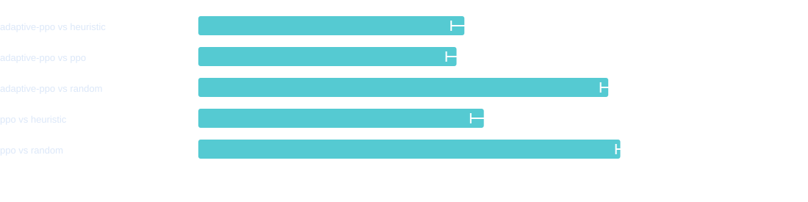
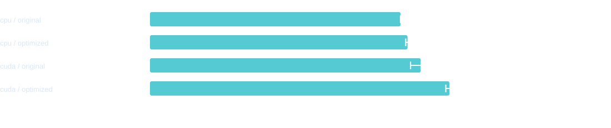
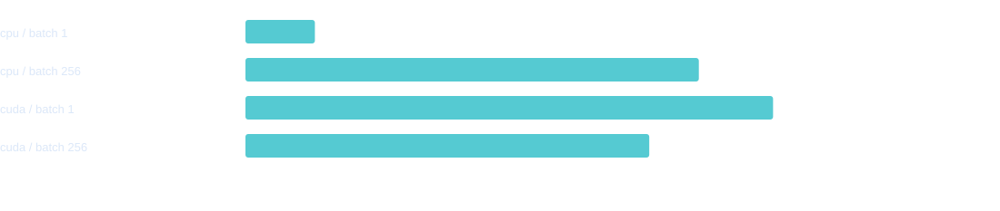

# 一键实验实测记录

2026-09-10，本机 Windows / RTX 4080 Laptop GPU / PyTorch 2.9.1+cu128。实际执行完整默认实验和小 demo，未按最终测试成绩回调训练参数。

```powershell
.venv/Scripts/python.exe experiment.py --output runs/experiment_full
.venv/Scripts/python.exe experiment.py --demo --output runs/experiment_demo_final
.venv/Scripts/python.exe -m pytest -q
```

正式实验 wall time 335.59 秒，含校准、训练、评估及原始 latency 测量。合计 450,000 局、6,254,725 个环境动作、52,303 次优化器更新。seed 42 在第 13 轮、43/44 在第 16 轮触发预定的验证集早停；对应每算法 65,000 / 80,000 / 80,000 局。小 demo 用时 19.79 秒，每算法 2,048 局。

49 项测试通过，覆盖实际 CPU/CUDA 混合采样、LR 边界与 KL 回退、精确续训、预算对齐、早停、测试种子隔离、旧 CLI 兼容性；SVG XML 和报告文件链接也已核验。

## 独立 baseline 测试

每个 seed / 对手 4,000 局，成对牌组交换座位。以下为三个训练 seed 的平均胜率，括号是跨训练 seed 的 95% t 区间。各自最佳检查点只按验证集选取。

| 算法 | 对手 | 平均胜率 | 95% 区间 |
| --- | --- | ---: | --- |
| adaptive-ppo | heuristic | 48.48% | [46.07%, 50.88%] |
| adaptive-ppo | ppo | 47.04% | [45.18%, 48.91%] |
| adaptive-ppo | random | 74.69% | [73.29%, 76.09%] |
| ppo | heuristic | 52.02% | [49.63%, 54.40%] |
| ppo | random | 76.88% | [76.10%, 77.67%] |

本次自适应版本对标准 PPO 的平均胜率 47.04%，未优于标准 PPO。对规则策略的胜率区间包含 50%，不能宣称已稳定战胜规则策略。训练预算是可复现的起始方案，不是收敛保证。



## 训练性能与优化

正式校准选择 CPU / 256 env / 4 PyTorch threads / 1 Rust worker。CPU 最佳候选中位吞吐量约 1,615 局/秒；CUDA 最佳候选约 1,464 局/秒（CPU 采样 + GPU 更新）。本轮校准中 GPU 最佳配置仍比 CPU 低约 9.4%，因此自动选 CPU；不同系统负载和 batch 下结果会改变。候选批量不同可能改变实际更新次数，完整计数已记录。

另外从 Git 原版本提取 PPO 做同配置前后测量：2,048 局、256 env、1 PyTorch / Rust thread、4 epochs、minibatch=512、deterministic=true、两版均关闭自适应 LR。每版本/设备预热后随机顺序测 3 次。每次均执行 32,054 个动作和 264 次梯度更新。

| 设备 | 原版本局/秒 | 优化后局/秒 | 中位数变化 |
| --- | ---: | ---: | ---: |
| cpu | 1055.1 | 1084.4 | +2.8% |
| cuda | 1139.9 | 1260.7 | +10.6% |

CPU 的 2.8% 差异较小，三次短测不足以证明稳定提升；GPU 本次改善约 10.6%。这是代码优化前后比较，与上述 CPU/GPU 各自调优后的选择是两个不同问题。优化合并采样结果拷贝、减少重复设备同步及不必要的数据传输，没有改变动作或特征定义。



## Latency

同一最佳模型、同一观测，warm-up 10 次，测 100 次。CPU 观测输入至 CPU 动作输出；CUDA 返回 NumPy 概率时同步等待完成。复核时移除了请求计时中额外的 CUDA barrier，并用原检查点重测；原含额外 barrier 的结果保留在各运行目录 `latency_with_extra_barrier.json`。重测时间和方法写入 JSON，不重新训练、不改变胜率数据。

| 设备 | batch | P50 ms | P95 ms | P99 ms | actions/s |
| --- | ---: | ---: | ---: | ---: | ---: |
| cpu | 1 | 0.074 | 0.086 | 0.092 | 13,351 |
| cpu | 256 | 0.396 | 0.563 | 0.751 | 598,622 |
| cuda | 1 | 0.315 | 0.655 | 0.788 | 2,614 |
| cuda | 256 | 0.376 | 0.501 | 0.627 | 654,683 |

本次单请求明显适合 CPU；256 batch 的 GPU P95 略低。延迟有系统调度和功耗状态波动，小 demo 与正式模型的原始测量都保留，不将某次测量外推为保证。batch 的摊销每动作耗时不是用户响应时间。



## 产物

- [紧凑验证数据](experiment_validation.json)；[优化前后逐次测量](ppo_optimization_measurements.json)。
- [正式离线报告](../runs/experiment_full/report.html)；[小 demo 报告](../runs/experiment_demo_final/report.html)。
- `runs/experiment_full/` 下保留完整原始 JSON/CSV/JSONL、所有 SVG、每算法/seed 的 `best.pt`、`latest.pt`、`policy.pt`。
- `runs/` 是运行产物忽略目录；`docs/experiment_figures/` 和上述紧凑数据可随源码版本控制。
- 重绘用 `experiment.py --render-only <results.json>`；预算及方法见 [EXPERIMENT.md](EXPERIMENT.md)。
